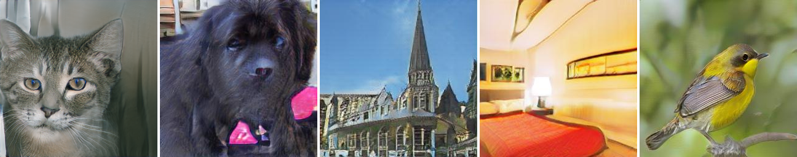

# StackGAN-v2-paddle

- [StackGAN-v1: Tensorflow implementation](https://github.com/hanzhanggit/StackGAN)

- [StackGAN-v1: Pytorch implementation](https://github.com/hanzhanggit/StackGAN-Pytorch)

- [Inception score evaluation](https://github.com/hanzhanggit/StackGAN-inception-model)

- [StackGAN-v2: Pytorch implementation](https://github.com/hanzhanggit/StackGAN-v2)

PaddlePaddle implementation for reproducing StackGAN_v2 results in the paper [StackGAN++: Realistic Image Synthesis with Stacked Generative Adversarial Networks](https://arxiv.org/abs/1710.10916) by Han Zhang*, Tao Xu*, Hongsheng Li, Shaoting Zhang, Xiaogang Wang,   Xiaolei Huang, Dimitris Metaxas in AI Studio.


### Dependencies
python 3.7

PaddlePaddle-GPU 2.1.2

In addition, please add the project folder to PYTHONPATH and `pip install` the following packages:
- `tensorboard`
- `python-dateutil`
- `easydict`
- `pandas`

**Data**
'

1. Download our preprocessed char-CNN-RNN text embeddings for training coco and evaluating coco, save them to `data/coco`.

    - [Optional] Follow the instructions [reedscot/icml2016](https://github.com/reedscot/icml2016) to download the pretrained char-CNN-RNN text encoders and extract text embeddings.

2. Download the coco image data. Extract them to `data/coco/`.

**Training**

- Train a StackGAN-v2 model on the coco dataset using our preprocessed embeddings:
  
    -Step 1: train Stage-I GAN (e.g., for 120 epochs) `python main.py --cfg cfg/coco_s1.yml --gpu 0`
    -Step 2: train Stage-II GAN (e.g., for another 120 epochs) `python main.py --cfg cfg/coco_s2.yml --gpu 1`

- If you want to try your own datasets, [here](https://github.com/soumith/ganhacks) are some good tips about how to train GAN. Also, we encourage to try different hyper-parameters and architectures, especially for more complex datasets.

**Evaluating**

- Run `python main.py --cfg cfg/eval_coco.yml --gpu 0` to generate samples from captions in validation set.
- Change the `eval_*.yml` files to generate images from other pre-trained models. 

**Examples generated by StackGAN-v2**



Tsne visualization of randomly generated [birds](examples/bird_res256_grid50x50.jpg), [dogs](dog_res256_grid50x50.jpg), [cats](examples/cat_res256_grid50x50.jpg), [churchs](examples/church_res256_grid50x50.jpg) and [bedrooms](examples/bedroom_res256_grid50x50.jpg)

### Citing StackGAN++
If you find StackGAN useful in your research, please consider citing:

```
@article{Han17stackgan2,
  author    = {Han Zhang and Tao Xu and Hongsheng Li and Shaoting Zhang and Xiaogang Wang and Xiaolei Huang and Dimitris Metaxas},
  title     = {StackGAN++: Realistic Image Synthesis with Stacked Generative Adversarial Networks},
  journal   = {arXiv: 1710.10916},
  year      = {2017},
}
```

```
@inproceedings{han2017stackgan,
Author = {Han Zhang and Tao Xu and Hongsheng Li and Shaoting Zhang and Xiaogang Wang and Xiaolei Huang and Dimitris Metaxas},
Title = {StackGAN: Text to Photo-realistic Image Synthesis with Stacked Generative Adversarial Networks},
Year = {2017},
booktitle = {{ICCV}},
}
```
**References**

- Generative Adversarial Text-to-Image Synthesis [Paper](https://arxiv.org/abs/1605.05396) [Code](https://github.com/reedscot/icml2016)
- Learning Deep Representations of Fine-grained Visual Descriptions [Paper](https://arxiv.org/abs/1605.05395) [Code](https://github.com/reedscot/cvpr2016)

